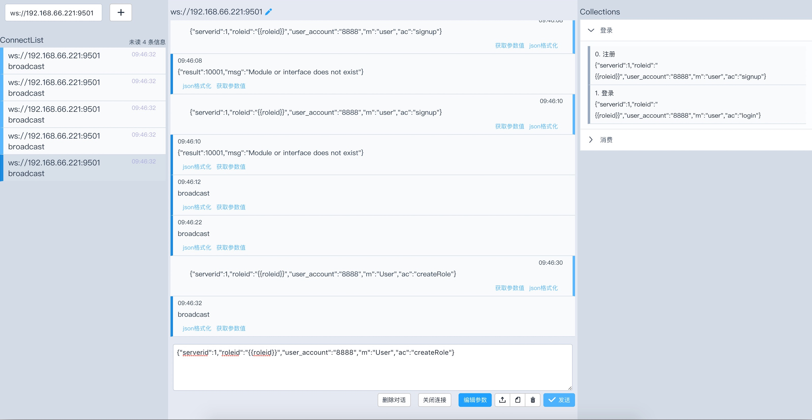
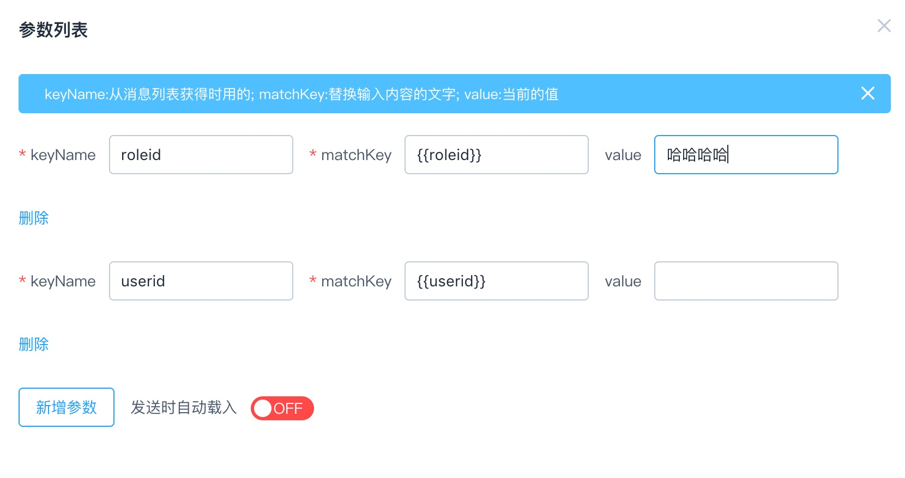
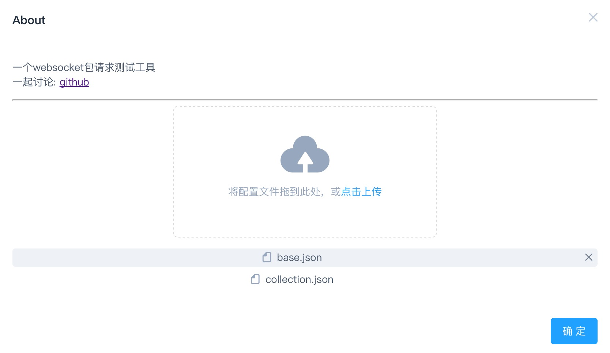

# WebSocket-Test
使用VUE写的websocket客户端，用于ws包的请求测试工具
[websocketest](http://www.websocketest.com) <br>

## 功能
- 可以同时连接很多服务器
- 发送的消息可以预先设定
- 读取json的内容作为参数
- 参数里的值，可以自动／手动替换到待发送的消息中
- 显示美化json的内容
- ……<br>
## 截图





## 待优化
- UI
- 新增的链接放到顶端
- 有什么建议可以issue反馈给我

## 感谢
[Element](http://element.eleme.io/#/zh-CN) <br>
[vue ](https://cn.vuejs.org/) <br>
[vuex](https://vuex.vuejs.org/) <br>


```
## License
GPL3
